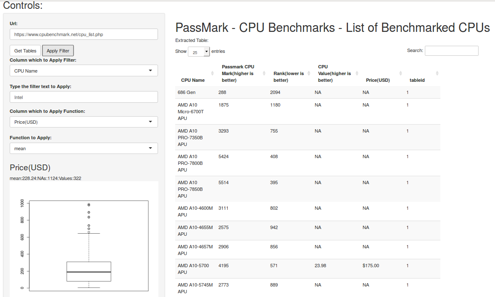

#Basic Documentation:

Control|Description
-------------------|------------------------------------
          | Type the desired web page which have a "**\<table\>**"  element then click on the "Get Table" Button. Then select the filter and functions options and hit "Apply".
                   |  Select the column and the text you wish to filter, blank equals to no filter. The R code on the server side will execute a **grep** command on the selected column with text provided . If we wished to filter the Intel computer from the previous table, we could just type "Intel" in the filter field.
                   |  Select the column and the function you wish to apply. There is two functions to choose from, "**mean**" and "**sum**", **na.rm** are set to **TRUE** on both functions. You should select a column with numbers only, otherwise the values will be coersed into "NA" and the resulting function will be undefined producing an error. A boxplot of the column values is also displayed.

---

# Web Application example:

Bellow is an application example for the https://www.cpubenchmark.net/cpu_list.php webpage:

</img>

 1. The selected url is  https://www.cpubenchmark.net/cpu_list.php.
 2. The "Get Table" extracts **all** tables with headers from the page. The table is displayed on the right.
 3. We filter only the lines where the "CPU Name" column contains the "Intel" text.
 4. Then We selected the mean of the "Price(USD)" column. 
 5. On the left is the resulting mean, number of NA values, number of valid occurrencies and a boxplot of the selected column.
