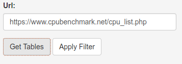
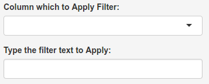
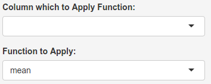

Control|Description
-------------------|------------------------------------
  | Type the desired web page which have a "**\<table\>**"  element then click on the "Get Table" Button. Then select the filter and functions options and hit "Apply".
                   |  Select the column and the text you wish to filter, blank equals to no filter. The R code on the server side will execute a **grep** command on the selected column with text provided . If we wished to filter the Intel computer from the previous table, we could just type "Intel" in the filter field.
                   |  Select the column and the function you wish to apply. There is two functions to choose from, "**mean**" and "**sum**", **na.rm** are set to **TRUE** on both functions. You should select a column with numbers only, otherwise the values will be coersed into "NA" and the resulting function will be undefined producing an error. A boxplot of the column values is also displayed.

Visit this project [gh-pages](https://marceloosg.github.io/htmltables/) for a more comprehensive documentation.
